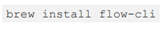
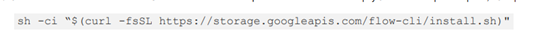
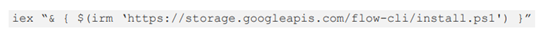

# Creation of an NFT marketplace

## Background and History 
NFTs and NFT marketplaces have recently taken the public interest,from collectors, investors and developers. 
NFTs seem to have come a long way from the first ever minted NFT by artist Kevin McCoy back in 2014. At that time, NFTs’ use case was more or less seen as confined to digital art. Fast forward to 2019 when the National Basketball Association (“NBA”), the NBA Players Association and Dapper Labs came together and collaborated to create NBA Top Shot, which they describe as a “revolutionary new experience in which jaw-dropping plays and unforgettable highlights become collectibles that you can own forever”. To put it in simpler terms, this is just about digitized or virtual trading cards but instead of just having a picture of the player and his career stats, each virtual card will show a particular play or highlight, for example a dagger shot that wins a game. (Source: https://ca.nba.com/news/what-is-nba-top-shot-explaining-the-blockchain-nba-highlight-collectables/18nram5ye1ub01hres3lkk3xvd#:~:text=In%20a%20joint%20venture%20that,you%20can%20own%20forever%2C%22%20per)
 
The next question was: beyond digital art and virtual trading cards, what are NFTs’ other use cases? Marketplaces have recently expanded from art, collectibles, sports memorabilia to tweets, memes and unique digital tokens. The possibilities are open to many other forms of unique items such as signed unique contract ownership, and generally, ownership of any unique digital or non digital token. There is therefore an opportunity to create a marketplace that houses any form of digital asset for public exchange and sale.This is what we have developed in prototype form.
What is a non fungible token in the first place? An NFT – short for “non-fungible token” – which is basically a digital file with verified unique identity and ownership. It is in the verification where blockchain is involved. As everyone would know, blockchain technology is an un-hackable system based on the mathematics of cryptography. An NFT is non-fungible because the asset is not interchangeable and is unique (unlike money and Bitcoins). The value of an NFT lies in providing the ability to securely value, purchase and sell digital art using a ledger that is open to everyone. One problem that should be addressed is the issue on a marketplace where a secured transfer of NFTs may be made.

 
## Project Aim
 
This Project is about building a blockchain that is more general purpose and a better fit for the NFT use cases using IPFS for storing and sharing. This smart contracts in this Project will be built on the Flow blockchain.
 
## Installation 
 
### Summary:
 
(1)	NFT minting process – creating the smart contract and minting a token;

(2)	Creating an app to view NFTs created through the smart contract;

(3)	Backing the NFT metadata and assets on IPFS – creating a marketplace to transfer NFTs to others while also transferring the NFT’s underlying assets on IPFS

Step-by-step installation:
 
I.                    Minting process
 
A.  	Setting up
 
1.   	Install Flow CLI
 
·         macOS :

 
·         Linux:
 
 
 
·         Windows

